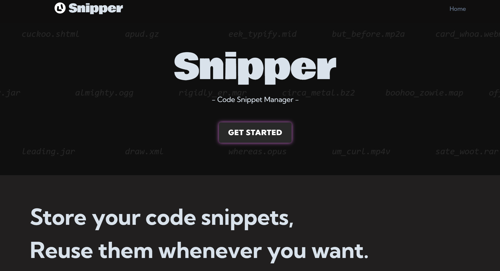

    
    <h1 align="center">Snipper - Your Snippet Manager</h1>

:sparkles: Visit our [website](https://snipper-frontend-production.up.railway.app/) here! 
Snipper is a simple tool app for you to keep your code snippets, supporting various language syntax highlighting.

This is the frontend repository of Snipper. The frontend of the website is built with Typescript + Vue.js.

## Website Preview

